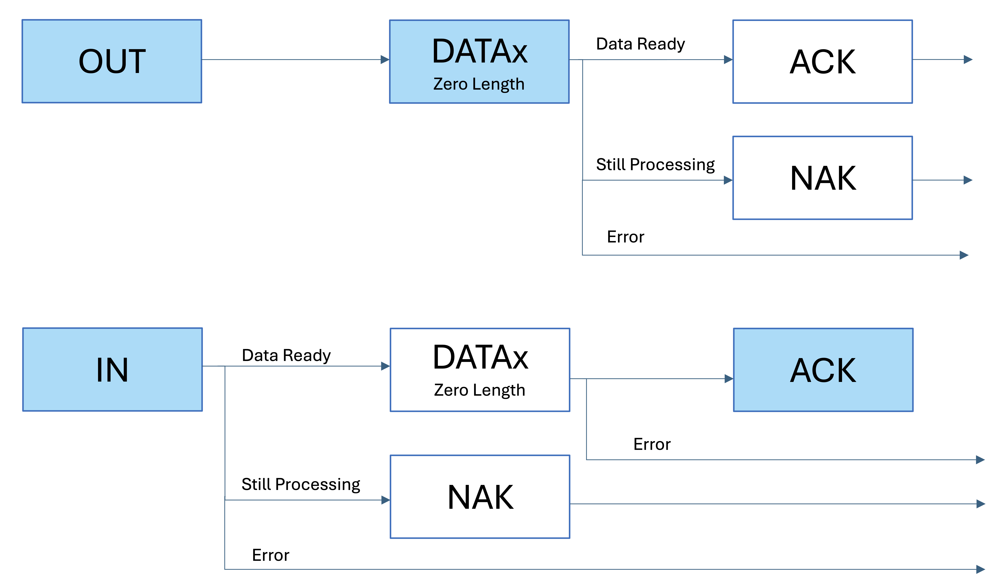

# A Working Example USB Driver on iPadOS based on  USBDriverKit
Copyright © 2025, Zonghua Ouyang All Rights Reserved.

版权 © 2025, Zonghua Ouyang 保留所有权利。

****

## How to Run the Example Code
### What Do You Need
- iPad with an M-Series Chip
- USB Cable
- Apple Developer Account
- FK750M1-VBT6 STM32 Board
- ST-Link for Downloading the Program to STM32

An iPad with an M-series chip is necessary since per Apple
>The base DriverKit framework is available in macOS for Apple silicon and Intel-based Mac computers, and in iPadOS for devices with an M-series chip. The availability of family frameworks like USBDriverKit and AudioDriverKit varies by platform.

>USBDriverKit is available on macOS for Intel and Apple Silicon devices, and on iPadOS for devices with an M-series chip.

The FK750M1-VBT6 STM32 Board can be easily aquired, figures below are some sources.
<center></center>    

Apple Developer account is needed to compile the project, it can be registered at [Apple Developer](https://developer.apple.com). It usually costs about $100 per year.

### Prepareation for Running the Example
Before compile the iPad App, you need to register your iPad on your Apple Developer account portal.

****

## Introduction to Universal Serial Bus 2.0 (USB 2.0)
This section will only covers the USB 2.0 specification, specifically Chapter 8 to Chapter 9. Although USB 3 and even USB 4 are popular on today's electonics market, the USB 2.0 protocol is already complex enough to understand. Also, as of May 2025, no STM32 supports USB 3. 

This section is intended for new USBers who have little or no background knowledge of USB. For simplicity, this section intentionally omit a lot of concept. For complete information refer to Universal Serial Bus Specification Revision 2.0.

## Architectural Overview
### Terminology
#### Classification of USB devices.
- USB Host. e.g. the iPad in the example, Computers, Laptops.
- USB Device
        - Hubs, which provide additional attachment points to the USB.
        - Functions, e.g. the STM32 Board in the example, Keyboard, Joystick    

In the text below, I will use USB Device (with capital letter "D") to refer hubs and functions (on oppose to USB Host), and use USB device to indicate all electronics with a USB interface (all include hosts, hubs and functions).

It is worth to mention that a lot of devices have both capabilities to be attached as functions and hosts. The usb port on these kind of devices are called On-the-go (OTG) (USB Type-B) or Dual role port (DRP) (USB Type-C). For example, an Android phone. If it is connected to a computer it is a function. If a mouse or a keyboard is connected to it, it is a host. The STM32 used in this example also can be programmed as a host.

#### Data Rates
- USB High-Speed: 480 Mbit/s
- USB Full-Speed: 12 Mbit/s
- USB Low-Speed: 1.5 Mbit/s

In this example, we will use USB full-speed of 12 Mbit/s, although USB high-speed is supported by the STM32, it requires an external PHY chip that is not on the PCB.

### Communication Flow
<center><p>Figure 5-9 of Universal Serial Bus Specification Revision 2.0 on Page 32</p></center>

> Even though the physical and logical topology of the USB reflects the shared nature of the bus, client software (CSw) manipulating a USB function interface is presented with the view that it deals only with its interface(s) of interest. Client software for USB functions must use USB software programming interfaces to manipulate their functions as opposed to directly manipulating their functions via memory or I/O accesses as with other buses (e.g., PCI, EISA, PCMCIA, etc.).

This is very important to write a USB driver. Although we only have one interface in the example code, there are a bunch of USB devices with multiple interfacese. For example, a keyboard with a trackpad, keyboared and trackpad are two interfaces. Usually, we write a driver for interfaces, not for devices.
<center><p>Figure 5-10 of Universal Serial Bus Specification Revision 2.0 on Page 33</p></center>

Figure above illustrage the relationship between endpoints, pipes whitin a given interface. We only have one endpoints (exclude the default control endpoint zero) in this example code.

## Protocol Layer
### Field Format
#### Packet Identifier (PID) Field 
<center><p>Figure 8-1 of Universal Serial Bus Specification Revision 2.0 on Page 195</p> </center>

The table below only describe the PID types that will be covered in this section. For the complete table of PID types, refer to Table 8-1 Universal Serial Bus Specification Revision 2.0 on Page 196.
| PID Type | PID Name | PID | Description |
| :------- | :------- | :-- | :---------- |
| Token    | OUT      |0001B| Host to Function Transaction |
|          | IN       |1001B| Functioin to Host Transaction |
|          | SETUP    |1101B| Host to Function Transaction for SETUP to a Control Pipe |
| Data     | DATA0    |0011B| Data Packet PID Even |
|          | DATA1    |1011B| Data Packet PID Odd |
| Handshake| ACK      |0010B| Receiver accepts error-free data packet |
|          | NAK      |1010B| Receiving device cannot accept data or transmitting device cannot send data for now.
| Special  |          |     |             |

#### Address (ADDR) Field
The function address (ADDR) field specifies the function. Each function will be assigned a address when attached to the host.
<center><p>Figure 8-2 of Universal Serial Bus Specification Revision 2.0 on Page 197</p> </center>

#### Endpoint (ENDP) Field
Endpoint field includes the endpoint number of which the packet intend to communicate with.
<center><p>Figure 8-3 of Universal Serial Bus Specification Revision 2.0 on Page 197</p> </center>

#### Data Field
Data field includes the data.
<center><p>Figure 8-4 of Universal Serial Bus Specification Revision 2.0 on Page 198</p> </center>

#### Cyclic Redundancy Checks (CRC) field
Contains CRC for error checking. Two types of CRCs are used, CRC5 for token packets and CRC16 for data packets.

### Packet Format
#### Token Packets

| PID | ADDR | ENDP | CRC5 |
| --- | ---- | ---- | ---- |
| 8 bits | 7 bits | 4 bits | 5 bits |

The PID of a token packets can be OUT, IN and SETUP.

#### Data Packets

| PID | DATA | CRC16 |
| --- | ---- | ---- |
| 8 bits | 8-8192 bits | 16 bits |

The PID of a data packets can be DATA0 and DATA1. They need to be used interleaved, i.e. if the previous packet is DATA0, then DATA1 should be used for this packet and DATA0 for the next packet.

#### Handshake Packets

| PID |
| --- |
| 8 bits |

ACK indicates that the data packet was received properly. NAK indicates that a function is still processing and not able accept data (OUT) or transmit data (IN). If NAK is returned, host will keep request until an ACK is received. If the data is corrupted, nothing is returned. Host will never return an NAK.

### Transaction Packet Sequence
Every transaction is initiated by host.

#### Control Transfers
Each control transfers have 3 or 2 stages, the setup stage, the data stage (optional), and the status stage.

In the first stage, the Setup packet is sent to the device. In the optional second stage, data is transferred between the host and the device. In the final stage, status is transferred between the host and the device.

##### Setup Stage
<center><p>Figure 8-36 of Universal Serial Bus Specification Revision 2.0 on Page 226</p></center>

If the function receives the data properlly it returns ACK, otherwise do nothing. The data contained in the data packet include the standard device requests that will disscussed later.

##### Data Stage
The optional Data Stage consists of IN or OUT transfers. The setup stage indicates the amount of data to be transmitted in this stage.

The data stage has two different scenarios depending upon the direction of data transfer. IN and OUT. IN means functions need to trasnsfer some data to host, and OUT means functions need to accept some data from host. The type of IN or OUT is also indicated in the setup stage.
<center><p>Figure Described Two Type of Data Stage. The box with blue background is sent by host, otherwise sent by function</p></center>

##### Status Stage
The status stage also has two different scenarios. If the host issued an IN packet in the data stage, then the host will send an OUT packet in the status stage. If the host issued an OUT packet in the data stage, or there is no data stage, then the host will send an IN packet in the status stage.
<center><p>Figure Described Two Type of Status Stage. The box with blue background is sent by host, otherwise sent by function</p></center>

##### Example
<center><p>An Example of a Complete Control Transfer</p></center>
The example above is acquired using a logic analyzer. You can try to identify each stage in the example above.

##### Code Implementation
When the STM32 received a setup token packet, the `HAL_PCD_SetupStageCallback()` function will be called once the setup stage is finished. The USB hardware on chip will automatically check the CRC and return the ACK, so no code is needed. The data received during the setup stage is stored in the `hpcd->Setup`. Code below is in the `usb.c`.
```C
void HAL_PCD_SetupStageCallback(PCD_HandleTypeDef *hpcd) {
	Log("HAL_PCD_SetupStageCallback()");
	CSM_USB_RequestTypeDef req = CSM_USB_ParseRequest((uint8_t*) hpcd->Setup);
	LogReq(req);
	switch (req.bmRequestType & 0x1F) {
		case 0:
			CSM_USB_DevReqHandle(hpcd, req);
			break;
		case 1:
			CSM_USB_IntReqHandle(req);
			break;
		case 2:
			CSM_USB_EpReqHandle(req);
			break;
		default:
			break;
	}
}
```
The data stage is implemented by using `HAL_PCD_EP_Transmit()`, for example
```C
HAL_PCD_EP_Transmit(hpcd, 0x00, USB_DeviceDescriptor, min(*USB_DeviceDescriptor, req.wLength));
```
The status stage is implemented by using `HAL_PCD_EP_Receive()` or `HAL_PCD_EP_Transmit()` with a zero length, for example
```C
HAL_PCD_EP_Receive(hpcd, 0x00, NULL, 0);
```
```C
HAL_PCD_EP_Transmit(hpcd, 0x00, NULL, 0);
```

#### Data (Bulk and Interrupt) Transfers
Bulk and data transfers have exactly the same sequence, so I will call them data transfers. There is actually no interrupt in the USB 2.0 protocol, the interrupt transfer also needs host to poll the function.
<center><p>Figure Described Data Transfers. The box with blue background is sent by host, otherwise sent by function</p></center>

As you may noticed, the data transfer sequence is exactly the same as the data stage in control transfers.

##### Code Implementation
To receive a data, we first need to wait the connection to be made, and then call `HAL_PCD_EP_Receive()`. Code below is in the `main.c`.
```C
while (CSM_USB_Ivars.USBState != CSM_USB_STATE_CONFIGURED) {
	  //Do Nothing But Wait
}
HAL_PCD_EP_Receive(CSM_USB_Ivars.pData, 0x01, CSM_USB_Ivars.USBReceiveBuffer, 5);
```
Once the data is successfully received by the STM32, `HAL_PCD_DataOutStageCallback()` will be called. The `HAL_PCD_DataOutStageCallback()` is implemented in `usb.c`
```C
void HAL_PCD_DataOutStageCallback(PCD_HandleTypeDef *hpcd, uint8_t epnum) {
	Log("HAL_PCD_DataOutStageCallback(epnum = %u)", epnum);
	ivars->USBReceiveInterrupt = (hpcd->OUT_ep[epnum].xfer_count) | 0x80000000;
}
```
The program in the infinite loop will sense the change of `USBReceiveInterrupt` and switch the LED as well as start a new receive session. Code below is in `main.c`
```C
while (1) {
        if (CSM_USB_Ivars.USBReceiveInterrupt != 0) {
                if (*CSM_USB_Ivars.USBReceiveBuffer == 0xEA) {
                        HAL_GPIO_WritePin(LED_GPIO_Port, LED_Pin, GPIO_PIN_RESET);
                }
                if (*CSM_USB_Ivars.USBReceiveBuffer == 0xFA) {
                        HAL_GPIO_WritePin(LED_GPIO_Port, LED_Pin, GPIO_PIN_SET);
                }
                HAL_PCD_EP_Receive(CSM_USB_Ivars.pData, 0x01, CSM_USB_Ivars.USBReceiveBuffer, 5);
                CSM_USB_Ivars.USBReceiveInterrupt = 0;
        }
}
```


## USB Device Framework
### USB Device Requests
<center><p>Table 9-2 of Universal Serial Bus Specification Revision 2.0 on Page 248</p></center>

The table above is used to parse the request in the sample code. The code below is in the `usb.c`
```C
CSM_USB_RequestTypeDef CSM_USB_ParseRequest(uint8_t *req) {
	CSM_USB_RequestTypeDef res;
	res.bmRequestType = *req;
	req++;
	res.bRequest = *(req);
	req++;
	res.wValue = SWAPBYTE(req);
	req++;
	req++;
	res.wIndex = SWAPBYTE(req);
	req++;
	req++;
	res.wLength = SWAPBYTE(req);
	return res;
}
```
Since the USB use LSB first order, we need to use `SWAPBYTE()` function to process the data.
<center><p>Simplified Table 9-3 of Universal Serial Bus Specification Revision 2.0 on Page 250</p></center>

The table above only shows the requests that been handled by the sample code. The code below is request handler of requests. The "Dev" in the function name `CSM_USB_DevReqHandle()` means the recipient of the request is device, this is indicated in the `bmRequestType` field. All three implemeted requests have a recipient of device.
```C
void CSM_USB_DevReqHandle(PCD_HandleTypeDef *hpcd, CSM_USB_RequestTypeDef req) {
	uint8_t *TxBuf = ivars->USBSetupTxBuffer;
	switch (req.bRequest) {
		case CSM_USB_REQUEST_SET_ADDRESS:
			HAL_PCD_SetAddress(hpcd, req.wValue);
			HAL_PCD_EP_Transmit(hpcd, 0x00, NULL, 0);
			break;
		case CSM_USB_REQUEST_GET_DESCRIPTOR:
			switch((req.wValue & 0xFF00) >> 8) {
				case CSM_USB_DESCRIPTOR_DEVICE:
					HAL_PCD_EP_Transmit(hpcd, 0x00, USB_DeviceDescriptor, min(*USB_DeviceDescriptor, req.wLength));
					HAL_PCD_EP_Receive(hpcd, 0x00, NULL, 0);
					break;
				case CSM_USB_DESCRIPTOR_STRING:
					TxBuf[0] = CSM_USB_Strlen16(USB_StringDescriptor[req.wValue & 0xFF]) + 2;
					TxBuf[1] = CSM_USB_DESCRIPTOR_STRING;
					memcpy(TxBuf + 2, USB_StringDescriptor[req.wValue & 0xFF], *TxBuf - 2);
					HAL_PCD_EP_Transmit(hpcd, 0x00, TxBuf, min(*TxBuf, req.wLength));
					HAL_PCD_EP_Receive(hpcd, 0x00, NULL, 0);
					break;
				case CSM_USB_DESCRIPTOR_CONFIGURATION:
					memcpy(TxBuf, USB_ConfigurationDescriptor, *USB_ConfigurationDescriptor);
					memcpy(TxBuf + *USB_ConfigurationDescriptor, USB_InterfaceDescriptor, *USB_InterfaceDescriptor);
					memcpy(TxBuf + *USB_ConfigurationDescriptor + *USB_InterfaceDescriptor, USB_EndpointDescriptor, **USB_EndpointDescriptor * CSM_USB_EP_COUNT);
					TxBuf[2] = *TxBuf + *USB_InterfaceDescriptor + **USB_EndpointDescriptor * CSM_USB_EP_COUNT;
					HAL_PCD_EP_Transmit(hpcd, 0x00, TxBuf, min(TxBuf[2], req.wLength));
					HAL_PCD_EP_Receive(hpcd, 0x00, NULL, 0);
					break;
				default:
					HAL_PCD_EP_Transmit(hpcd, 0x00, NULL, 0);
					HAL_PCD_EP_Receive(hpcd, 0x00, NULL, 0);
			}
			break;
			case CSM_USB_REQUEST_SET_CONFIGURATION:
				ivars->USBState = CSM_USB_STATE_CONFIGURED;
				HAL_PCD_EP_Transmit(hpcd, 0x00, NULL, 0);
				break;
	}
	Log("CSM_USB_DevReqHandle() Finished");
}
```
The SET_CONFIGURATION request indicates that the connection has been made, and the data transfer may begin. So we set the `USBState` to `CSM_USB_STATE_CONFIGURED`.

### USB Descriptor
All the descriptor are defined in the `usb_descriptor.h`

#### Standard Device Descriptor
| Offset | Field        | Size   | Value         | Value in Example Code | Description   |
| :------| :----------- | :----- | :------------ | :-------------------- | :------------ |
| 0      | bLength      | 1      | Number        | 18                    | Size of this descriptor in bytes |
| 1      | bDescriptorType | 1   | Constant      | CSM_USB_DESCRIPTOR_DEVICE (1) | DEVICE Descriptor Type |
| 2      | bcdUSB       | 2      | BCD           | 0x0200                | USB Specification Release Number in Binary-Coded Decimal (i.e., 2.10 is 210H). This field identifies the release of the USB Specification with which the device and its descriptors are compliant. |
|4       | bDeviceClass | 1      | Class         | 0x00                  | Class code (assigned by the USB-IF). Find more on [Defined Class Codes](https://www.usb.org/defined-class-codes) |
| 5 | bDeviceSubClass | 1 | SubClass | 0x00 | Subclass code (assigned by the USB-IF). |
| 6 | bDeviceProtocol | 1 | Protocol | 0x00 | Protocol code (assigned by the USB-IF). |
| 7 | bMaxPacketSize | 1 | Number | 64 | Maximum packet size for endpoint zero (only 8, 16, 32, or 64 are valid) |
| 8 | idVendor | 2 | ID | 0x0648 | Vendor ID (assigned by the USB-IF). The vendor id along with the product id is used to match the driver on iPad (which will be explained later). Technically if you are a company that designs USB products, you need to request a vendor id from USB-IF, it costs around $6,000. More informatioin can be found on [Getting a Vendor ID](https://www.usb.org/getting-vendor-id) | 
| 10 | idProduct | 2 | ID | 0xEEEE | Product ID (assigned by the manufacturer) |
| 12 | bcdDevice | 2 | BCD | 0xEEEE | Device release number in binary-coded decimal |
| 14 | iManufacturer | 1 | Index | 1 | Index of string descriptor describing manufacturer |
| 15 | iProduct | 1 | Index | 2 | Index of string descriptor describing manufacturer |
| 16 | iSerialNumber | 1 | Index | 3 | Index of string descriptor describing the device’s serial number |
| 17 | bNumConfigurations | 1 | Number | 1 | Number of possible configurations |

#### Standard Configuration Descriptor
| Offset | Field        | Size   | Value         | Value in Example Code | Description   |
| :------| :----------- | :----- | :------------ | :-------------------- | :------------ |
| 0 | bLength | 1 | Number | 9 | Size of this descriptor in bytes |
| 1 | bDescriptorType | 1 | Constant | CSM_USB_DESCRIPTOR_CONFIGURATION (2) | CONFIGURATION Descriptor Type |
| 2 | wTotalLength | 2 | Number | This field is calculated by the code before transmitting |Total length of data returned for this configuration. Includes the combined length of all descriptors (configuration, interface, endpoint, and class- or vendor-specific) returned for this configuration. |
| 4 | bNumInterfaces | 1 | Number | 1 | Number of interfaces supported by this configuration |
| 5 | bConfigurationValue | 1 | Number | 1 | Value to use as an argument to the SET_CONFIGURATION request to select this configuration |
| 6 | iConfiguration | 1 | Index | 4 | Index of string descriptor describing this configuration |
| 7 | bmAttributes | 1 | Bitmap | 0x80 (Not Self-Powered, No Remote Wakeup) | Configuration characteristics D7: Reserved (set to one); D6: Self-powered; D5: Remote Wakeup; D4...0: Reserved (reset to zero) | 
| 8 | bMaxPower | 1 | mA | 200 | Maximum power consumption of the USB device from the bus in this specific configuration when the device is fully operational. Expressed in 2 mA units (i.e., 50 = 100 mA). |

#### Standard Interface Descriptor
| Offset | Field        | Size   | Value         | Value in Example Code | Description   |
| :------| :----------- | :----- | :------------ | :-------------------- | :------------ |
| 0 | bLength | 1 | Number | 9 | Size of this descriptor in bytes |
| 1 | bDescriptorType | 1 | Constant | CSM_USB_DESCRIPTOR_INTERFACE (4) | INTERFACE Descriptor Type |
| 2 | bInterfaceNumber | 1 | Number | 0 | Number of this interface. Zero-based value identifying the index in the array of concurrent interfaces supported by this configuration. |
| 3 | bAlternateSetting | 1 | Number | 0 | Value used to select this alternate setting for the interface identified in the prior field |
| 4 | bNumEndpoints | 1 | Number | 2 | Number of endpoints used by this interface (excluding endpoint zero). If this value is zero, this interface only uses the Default Control Pipe |
| 5 | bInterfaceClass | 1 | Class | 0xFF | Class code (assigned by the USB-IF). If this field is set to 0xFF, the interface class is vendor-specific. More on  [Defined Class Codes](https://www.usb.org/defined-class-codes) |
| 6 | bInterfaceSubClass | 1 | SubClass | 0xFF | Subclass code (assigned by the USB-IF). |
| 7 | bInterfaceProtocol | 1 | Protocol | 0xFF | Protocol code (assigned by the USB). If this field is set to FFH, the device uses a vendor-specific protocol for this interface.|
| 8 | iInterface | 1 | Index | 5 | Index of string descriptor describing this interface |

#### Standard Endpoint Descriptor
| Offset | Field        | Size   | Value         | Value in Example Code for EP1OUT | Value in Example Code for EP1IN | Description   |
| :------| :----------- | :----- | :------------ | :----------- | :------------ | :----|
| 0 | bLength | 1 | Number | 7 | 7 | Size of this descriptor in bytes |
| 1 | bDescriptorType | 1 | Constant | CSM_USB_DESCRIPTOR_ENDPOINT (5) | 5 | ENDPOINT Descriptor Type |
| 2 | bEndpointAddress | 1 | Endpoint | 0x01 (Epnum: 1, Dir: OUT) | 0x81 (Epnum: 1, Dir: IN) | The address is encoded as follows: Bit 3...0: The endpoint number; Bit 6...4: Reserved, reset to zero; Bit 7: Direction, ignored for control endpoints |
| 3 | bmAttributes | 1 | Bitmap | 0x02 (Bulk) | 0x02 (Bulk) | Bits 1..0: Transfer Type; 00 = Control; 01 = Isochronous; 10 = Bulk; 11 = Interrupt |
| 4 | wMaxPacketSize | 2 | Number | 0x0200 (512) | 0x0200 (512) | Maximum packet size this endpoint is capable of sending or receiving  bits 10..0 specify the maximum packet size (in bytes).
| 6 | bInterval | 1 | Number | 0xFF (255 ms) | 0xFF (255 ms) | Interval for polling endpoint for data transfers. Expressed in frames (1 ms unit).

#### Standard String Descriptor
| Offset | Field        | Size   | Value         | Description   |
| :------| :----------- | :----- | :------------ | :------------ |
| 0 | bLength | 1 | Number | Size of this descriptor in bytes |
| 1 | bDescriptorType | 1 | Constant | STRING Descriptor Type |
| 2 | bString | N | Number | UTF-16LE encoded string |

### Example of How a Connection is Extablished
| [WireShark.pdf](WireShark.pdf) |
|---|

<div id="adobe-dc-view" style="height: 500px"></div>
<script src="https://acrobatservices.adobe.com/view-sdk/viewer.js"></script>
<script type="text/javascript">
	document.addEventListener("adobe_dc_view_sdk.ready", function(){ 
		var adobeDCView = new AdobeDC.View({clientId: "cb2bd093f630412f8cc2b007189ce8fc", divId: "adobe-dc-view"});
		adobeDCView.previewFile({
			content:{location: {url: "WireShark.pdf"}},
			metaData:{fileName: "WireShark.pdf"}
		}, {embedMode: "SIZED_CONTAINER"});
	});
</script>

The example above is a real example captured by WireShark. The original WireShark data is in the `WireShark.pcapng`

****

## Introduction to USBDriverKit
Before reading this section, I strongly recommand you to read three articles from Apple first.
- [Creating a Driver Using the DriverKit SDK](https://developer.apple.com/documentation/driverkit/creating-a-driver-using-the-driverkit-sdk)
- [Creating drivers for iPadOS](https://developer.apple.com/documentation/driverkit/creating-drivers-for-ipados)
- [Communicating between a DriverKit extension and a client app](https://developer.apple.com/documentation/driverkit/communicating-between-a-driverkit-extension-and-a-client-app)

### Matching the USB Driver
When a USB device is attached to iPad, the iPadOS will start to search for a driver for this attached device. The searching is based on the information in the descriptor along with the `info.plist` within the driver.
<center><p>info.plist of the sample code</p></center>

| Keys | Comments | Probe Score |
| :-- | :-- | :-- |
| idVendor + idProduct + bInterfaceNumber + bConfigurationValue + bcdDevice | | 100000 |
| idVendor + idProduct + bInterfaceNumber + bConfigurationValue | | 90000 |
| idVendor + bInterfaceSubClass + bInterfaceProtocol | Only if bInterfaceClass is 0xFF (vendor specific). | 80000 |
| idVendor + bInterfaceSubClass | Only if bInterfaceClass is 0xFF (vendor specific). | 70000 |
| bInterfaceClass + bInterfaceSubClass + bInterfaceProtocol | Only if bInterfaceClass is not 0xFF. | 60000 |
| bInterfaceClass + bInterfaceSubClass | Only if bInterfaceClass is not 0xFF. | 50000 |

If there is multiple drivers been matched with the attached device, iPadOS will chose the driver with the highest probe score.

### Entitlement
In order to communicate with the usb device, the `.entitlement` file is needed to be configured. Usually the xCode will automatically generate the `.entitlement` file, if you add the corresponding capabilities. The only entitlement we need to configure manually is the com.apple.developer.driverkit.transport.usb (displayed as DriverKit USB Transport). 

You can use a wildcard in the idVendor field when developing. But if you need to publish your app to the App Store, you need to change that wildcard into your own vendor id and request the entitlement from Apple. More information about requesting the entitlement can be found on [Requesting Entitlements for DriverKit Development](https://developer.apple.com/documentation/driverkit/requesting-entitlements-for-driverkit-development)
<center><p>NullUSBDriver.entitlement of the sample code</p></center>

### Structure of the Driver

If you have read the article, [Creating a Driver Using the DriverKit SDK](https://developer.apple.com/documentation/driverkit/creating-a-driver-using-the-driverkit-sdk), mentioned before, I believed you had some basic understading of the life cycle.

The example app is composed with two parts, the user app and the driver. The driver is also divided into two parts, NullUSBDriver and NullUSBDriverUserClient. 

When the USB device is connected to iPad, the iPadOS will search for the driver and call `Start()` in the `NullUSBDriver.cpp`. When disconnected, `Stop()` will be called. 

When the user app calling the `IOServiceOpen()` function, 
```CPP
ret = IOServiceOpen(device, mach_task_self_, 0, &connection);
```
the `NewUserClient()` method within the `NullUSBDriver.cpp` will be called. In the `NewUserClient()` method, it calls `Create()`.
```CPP
ret = Create(this, "UserClientProperties", &client);
```
Once calling the `Create()`, the system will call `Start()` in the `NullUSBDriverUserClient.cpp`.

<center><p>Structure Overview</p></center>

